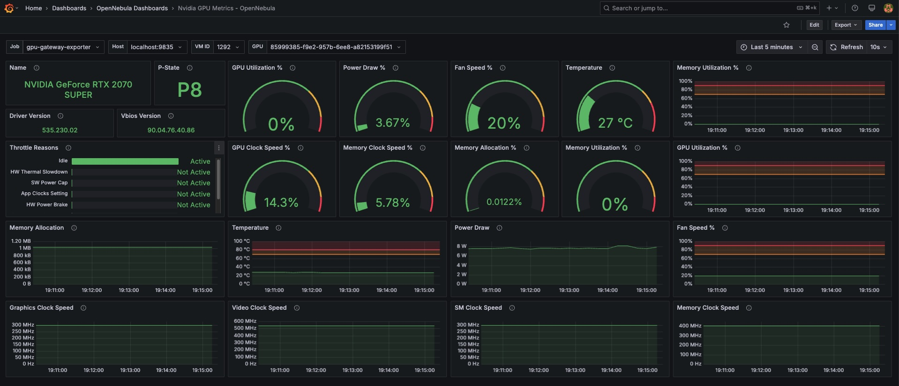

# GPU Gateway Exporter

A Prometheus-compatible gateway exporter that collects metrics from multiple virtual machines running Prometheus exporters (e.g., `nvidia-smi`). Metrics are dynamically enriched with metadata (like `vm_id`) and served through a unified `/metrics` endpoint, making it easy to build flexible and VM-aware dashboards in Grafana.

While the default use case focuses on NVIDIA GPU metrics, this gateway can be adapted to aggregate **any type of Prometheus-compatible exporter** (e.g., node exporter, custom exporters, app-specific metrics).

---

## 🚀 Features

- Connects to exporters running inside virtual machines. Uses **QEMU Guest Agent** to obtains metrics with CURL to localhost:exporter_port.
- Caches metrics with TTL to reduce latency and avoid timeouts.
- Labels every metric with `vm_id` or other VM metadata.
- Deployable via **Docker** or **systemd service**.
- Suitable for **nvidia-smi exporter** or any other Prometheus exporters.

---

## 📦 System Requirements

### ✅ ONE FE

- Python 3.10+ if you want to run as systemd service
- Docker if you want to use it as a container

### ✅ ONE Host 

- Access through ONE FE and ONE Host with SSH using RSA Keys  
- BASH
- virsh + qemu-agent

### ✅ Virtual Machines

Each VM from which you want to collect metrics must have:

- A running Prometheus exporter ([`nvidia_gpu_exporter`](https://github.com/utkuozdemir/nvidia_gpu_exporter)). See ANNEX A. 
- `qemu-guest-agent` installed and running (for auto-discovery)

## How to run it

### Docker

```
docker build -t gpu-gateway-exporter .

docker run -tid --env-file .env -v /var/lib/one/.ssh/id_rsa:/root/.ssh/id_rsa_oneadmin:ro --network host --name gpu-gateway-exporter gpu-gateway-exporter
```

### Docker Compose

```
docker compose up -d
```


### Systemd


## 📡 Prometheus Configuration

To collect GPU metrics from the Gateway Exporter, you need to configure Prometheus to scrape its `/metrics` endpoint.

---

### 🔧 Add a New Job to `prometheus.yml`

Edit your Prometheus configuration file (typically located at `/etc/prometheus/prometheus.yml`) and add the following job under `scrape_configs`:

```yaml
scrape_configs:
  - job_name: 'nvidia-smi-vm'
    scrape_interval: 15s
    scrape_timeout: 10s
    static_configs:
      - targets: ['<exporter-host>:9835']
```

* scrape_interval: How often Prometheus scrapes the exporter. Default is 1 minute, but we recommend reducing it to 15 seconds for near-real-time GPU metrics.

* scrape_timeout: How long Prometheus will wait for a response before failing the scrape. It must be less than or equal to scrape_interval.

Replace <exporter-host> with the hostname or IP address of the server where your GPU Gateway Exporter is running.

If Prometheus and the exporter are running on the same host, use localhost:9835 by default.


## 📊 Grafana Integration

This project includes a preconfigured Grafana dashboard for visualizing GPU metrics collected by the gateway exporter. It allows filtering by virtual machine (`vm_id`) and GPU (`uuid`), making it easy to explore GPU usage across multiple VMs.

### 🧭 How to Import the Dashboard

1. Log in to your existing Grafana instance.
2. In the sidebar, go to **Dashboards > New > Import**.
3. Click **Upload JSON file** and select the file: grafana/nvidia_smi_vms.json
4. Choose your **Prometheus** data source from the dropdown.
5. Click **Import**.

### 🎛️ Using the Dashboard Filters

At the top of the dashboard, you'll find two dropdown filters:

#### 1. `vm_id`
- This filter allows you to select one or more virtual machines from which metrics are being collected.
- It corresponds to the `vm_id` label added by the gateway.

#### 2. `uuid` (optional)
- This allows you to filter by GPU device within the selected VM(s).
- Useful when VMs have multiple GPUs and you want per-GPU visibility.





## ANNEX A: Script to install the exporter on the VM

```
#!/bin/bash

set -e

# Requires jq: sudo apt install jq
echo "🔍 Searching for the latest release of nvidia_gpu_exporter for amd64..."

# Download the latest release and filter for the .deb file targeting amd64
LATEST_URL=$(curl -s https://api.github.com/repos/utkuozdemir/nvidia_gpu_exporter/releases/latest \
  | jq -r '.assets[] | select(.name | endswith("_amd64.deb")) | .browser_download_url')

if [ -z "$LATEST_URL" ]; then
  echo "❌ No .deb file for amd64 found in the latest release."
  exit 1
fi

# Get the name of the .deb file
DEB_FILE=$(basename "$LATEST_URL")

echo "⬇️ Downloading $DEB_FILE from $LATEST_URL ..."
curl -L -o "$DEB_FILE" "$LATEST_URL"

echo "📦 Installing $DEB_FILE ..."
sudo dpkg -i "$DEB_FILE"

echo "🧹 Removing $DEB_FILE ..."
rm "$DEB_FILE"

echo "✅ Installation completed successfully."
```

## ANNEX: Script to install the NVIDIA drivers on the VM

```
#!/bin/bash

set -e

echo "🔍 Detecting NVIDIA GPU..."
GPU_INFO=$(lspci | grep -i 'nvidia' || true)

if [ -z "$GPU_INFO" ]; then
  echo "❌ No NVIDIA GPU detected on this system."
  exit 1
fi

echo "✅ GPU detected:"
echo "$GPU_INFO"
echo

# Detect distro
DISTRO=$(awk -F= '/^ID=/{print tolower($2)}' /etc/os-release | tr -d '"')

ask_to_proceed() {
  read -p "Do you want to install NVIDIA drivers for this GPU? [Y/n]: " choice
  case "$choice" in
    [Yy]* | "") return 0 ;;
    *) echo "⛔ Aborting installation."; return 1 ;;
  esac
}

install_for_ubuntu() {
  echo "📦 Updating system and installing drivers via ubuntu-drivers..."
  sudo apt update
  sudo apt install -y ubuntu-drivers-common
  echo "🔎 Detecting recommended driver..."
  ubuntu-drivers devices
  ask_to_proceed || exit 1
  sudo ubuntu-drivers autoinstall
}

install_for_debian() {
  echo "📦 Installing drivers via nvidia-detect (Debian)..."
  sudo apt update
  sudo apt install -y nvidia-detect
  DRIVER=$(nvidia-detect | grep -oP 'nvidia-driver-\K[0-9]+')
  if [ -z "$DRIVER" ]; then
    echo "⚠️ Could not determine exact driver package. Please install manually."
    exit 1
  fi
  echo "🔧 Recommended driver version: $DRIVER"
  ask_to_proceed || exit 1
  sudo apt install -y "nvidia-driver"
}

install_for_almalinux() {
  echo "📦 Installing drivers using NVIDIA's CUDA repository (AlmaLinux/RHEL)..."
  ask_to_proceed || exit 1

  sudo dnf install -y epel-release
  sudo dnf config-manager --add-repo=https://developer.download.nvidia.com/compute/cuda/repos/rhel8/x86_64/cuda-rhel8.repo
  sudo dnf clean all
  sudo dnf -y module install nvidia-driver:latest-dkms
}

case "$DISTRO" in
  ubuntu)
    install_for_ubuntu
    ;;
  debian)
    install_for_debian
    ;;
  almalinux|rocky|centos|rhel)
    install_for_almalinux
    ;;
  *)
    echo "❌ Unsupported distribution: $DISTRO"
    exit 1
    ;;
esac

echo "✅ NVIDIA driver installation completed. A reboot is recommended."

```